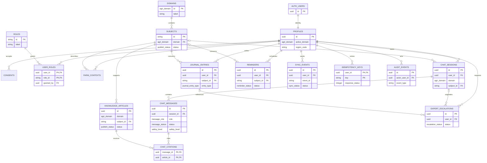

# AgriCare AI — Database Schema MVP

## Stack context

PostgreSQL trên Supabase; `auth.users` là source of truth cho identity. API FastAPI là boundary nghiệp vụ, mobile không truy cập service-role key. Phân loại S1: pilot nhỏ, dữ liệu cá nhân và nội dung chuyên môn cần RLS/audit.

## Ownership and relationships

```text
auth.users 1──1 profiles 1──N farm_contexts
profiles 1──N consents
domains 1──N subjects 1──N knowledge_articles
profiles 1──N chat_sessions 1──N chat_messages N──N knowledge_articles (citations)
profiles 1──N journal_entries
profiles 1──N reminders
profiles 1──N expert_escalations
profiles 1──N sync_events / idempotency_keys / audit_events
```

## Entity relationship diagram



`o|` thể hiện quan hệ tùy chọn, ví dụ một chat session hoặc journal entry có thể chưa tạo escalation. `chat_citations` là bảng nối many-to-many giữa assistant message và knowledge article.

## Tables

### Identity and farm context

- `profiles`: public app profile keyed to `auth.users.id`; no password storage.
- `roles`: controlled roles: `user`, `expert`, `editor`, `admin`.
- `user_roles`: many-to-many role assignment. A person can hold multiple roles; `granted_by` records who assigned it.
- `farm_contexts`: optional crop/animal context; region code is coarse, never exact coordinates in MVP. A user may have multiple contexts.
- `consents`: immutable consent/version records for privacy, AI disclaimer and notifications.

### Domain and knowledge

- `domains`: seeded `plant` and `animal` records.
- `subjects`: supported crop/species, e.g. rice, vegetables, chicken, pig.
- `knowledge_articles`: reviewed/published article metadata and searchable text.
- Article provenance is stored on `knowledge_articles`; assistant-to-article evidence is stored in `chat_citations`.

Only `knowledge_articles.status = 'published'` can be retrieved by chatbot. Drafts are editor-only.

### Chat and safety

- `chat_sessions`: one user conversation scoped to one domain/subject.
- `chat_messages`: user/assistant messages, processing status, safety level, model/provider metadata.
- `chat_citations`: explicit many-to-many link between assistant message and knowledge article/source.

Assistant messages must be persisted with status and citations in one application transaction after retrieval/generation. Provider failure creates `failed`, never a fabricated answer.

### User operations

- `journal_entries`: user-owned timeline entries, soft delete, client event ID for offline sync.
- `reminders`: user-owned scheduled actions with IANA timezone and recurrence JSON only for recurrence rules.
- `expert_escalations`: explicit user-shared case, status lifecycle and coarse region.

Role rules:

- `user`: access own profile, chat, journal, reminders and explicitly shared escalations.
- `expert`: read/update escalations assigned to that expert; cannot browse all users by default.
- `editor`: create/review/publish knowledge articles.
- `admin`: manage role assignments, policy configuration and audit access.

Role assignment is server-side only. The client never submits a role to authorize an operation.

### Reliability, privacy and audit

- `sync_events`: server record of client events; unique per `(user_id, event_id)`.
- `idempotency_keys`: request result cache for retried writes; bounded retention.
- `audit_events`: append-only security/product events without raw message, image or token contents.

## Invariants

- In local PostgreSQL, user-owned access is enforced by FastAPI ownership queries; in Supabase production, add RLS policy `user_id = auth.uid()` as defense in depth.
- `knowledge_articles.domain` is denormalized for feed/search indexes; the API must validate it matches `subjects.domain` before writes.
- All timestamps use `timestamptz`; client timezone is stored separately only where scheduling matters.
- Delete user data by user ID in a controlled transaction; hard-delete policy must be confirmed before production.
- Exact location, access tokens, image bytes and full sensitive text are not stored in audit/log tables.
- `client_event_id`/`event_id` and `Idempotency-Key` make retries safe.

## Index rationale

| Index | Query shape | Reason |
|---|---|---|
| `subjects(domain, status)` | list supported subjects by tab | small selective seed list |
| `knowledge_articles(status, domain, published_at desc)` | browse published articles | stable feed ordering |
| `knowledge_articles using gin(search_vector)` | full-text search | avoids substring scan |
| `chat_sessions(user_id, updated_at desc)` | conversation list | user feed |
| `chat_messages(session_id, created_at asc)` | message history | chronological read |
| `journal_entries(user_id, observed_at desc)` | timeline | primary user read path |
| `reminders(user_id, due_at, status)` | upcoming reminders | notification worker query |
| `sync_events(user_id, created_at desc)` | sync status | pending/conflict inspection |

## Migration and verification

1. For plain local PostgreSQL, run `python -m services.api.db.run_local_migrations`; it applies `000_local_bootstrap.sql`, `001_initial_schema.sql` and `002_local_compat.sql`.
2. For Supabase, apply `001_initial_schema.sql` and then `002_rls.sql` through the Supabase migration flow.
3. Seed domains/subjects and synthetic knowledge fixtures.
4. Test anonymous, own-user and cross-user access; local PostgreSQL relies on API authorization while Supabase also uses RLS.
4. Run API contract tests for CRUD, duplicate event, conflict, soft-delete and timezone boundaries.
5. Before production, validate backup/restore, deletion request flow and index plans with representative data.

The SQL migration is a draft and must not be applied to production until owner, retention and legal review are approved.
